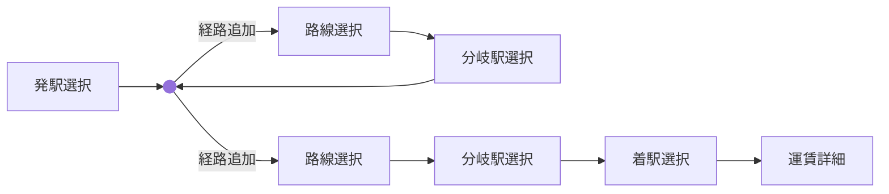

# ヘルプ画面仕様

## 対象

- ルート: `/help`
- 実装: `src/routes/help/+page.svelte`

## 表示内容

- アプリ概要
- 基本的な使い方
- メイン画面の各部説明
- 画面別の操作マニュアル
- 主な設定・オプション
- 保存・共有・再利用
- 外部サイト導線
- 不具合報告・問い合わせ
- 注意・免責

## 操作

- ブログリンクを別タブで開く
- 閉じるで `/` に戻る
- 外部サイトへのリンクは、通常文と見分けられる装飾を付ける

## マニュアルとして載せる内容

### 基本的な使い方

#### 経路を指定して運賃額を確認

#### 最短経路検出

- 発駅カードから発駅を設定する
- `+ 経路を追加` から路線と次駅を追加する
- 運賃サマリーまたは区間カードから詳細画面を開く
- 経路を指定して運賃額を確認する流れをフロー図で表示する
- 最短経路検出の流れをフロー図で表示する
- 「保存画面を開き」の文言はページ内リンクにし、`archive-manual` へ移動できるようにする
- 必要に応じて保存画面や共有を使う
- ハンバーガーメニューの案内は実際の `menu` アイコン表示で示す

### メイン画面の各部説明

- 左側にメイン画面のスクリーンショットを配置する
- スクリーンショットは縦長画面全体が見えるよう縮小表示し、上下をトリミングしない
- 右側に各部説明と下部ツールバー表を配置する
- 発駅カード: 現在の発駅を設定・変更する入口
  - 「発駅カード」の文言はページ内リンクにし、「発着駅選択」セクションへ移動できるようにする
  - ページ内リンクであることが分かるよう、通常文と見分けられる装飾を付ける
- 区間カード: 追加済み区間を確認し、途中までの詳細を開く入口
- 運賃サマリーカード: 全体の計算結果を確認する入口
  - 運賃サマリーカードの文言はページ内リンクにし、「運賃詳細」セクションへ移動できるようにする
- `+ 経路を追加`: 路線追加フローへ進む
  - `+ 経路を追加`の文言はページ内リンクにし、「路線選択」セクションへ移動できるようにする
- 右上メニューは実際の `more_vert` アイコン表示を添えて、バージョン情報、ヘルプ、経路オプションを開くことを説明する
- 下部操作ナビには、アイコン画像と説明を並べた 2 列の表を載せる

### 画面別の操作マニュアル

- 各画面に対応する小さなスクリーンショットを添える
- スクリーンショットは縦長画面全体が見えるよう縮小表示し、上下をトリミングしない
- `/terminal-selection`: グループ、都道府県、履歴、検索から発駅または着駅を探す
- `/line-selection`: 現在駅や選択文脈に応じた路線候補を選ぶ
  - 「次の駅を選ぶ画面へ進みます」の文言はページ内リンクにし、「駅選択」セクションへ移動できるようにする
- `/route-station-select`: 分岐駅または着駅を確定して経路へ追加する
- `/detail`: 運賃、営業キロ、有効日数、注記、実際の `share` アイコンによる共有、実際の `description` アイコンによる結果エクスポートを確認する
- `/save`: 現在経路の保存、保存済み経路の読込、インポート、エクスポートを行う

### 保存画面の詳細説明

- 保存画面は独立した詳細セクションとして扱う
- 保存画面全体のスクリーンショットを載せる
- 保存画面全体のスクリーンショットは縦長画面全体が見えるよう縮小表示し、上下をトリミングしない
- インポート入力ダイアログのスクリーンショットを載せる
- エクスポート結果ダイアログのスクリーンショットを載せる
- 全体画面では現在経路カード、保存済み経路一覧、下部アクションバーの役割を説明する
- インポート画面では複数行入力、1行1経路、実行ボタンの意味を説明する
- エクスポート画面では出力テキスト、コピー結果、再利用方法を説明する

### 主な設定・オプション

- 大阪環状線の近回り / 遠回り切替
- 小倉-博多間新幹線在来線別線扱い
- 詳細画面での特例適用や最安経路計算などの再計算オプション

### 保存・共有・再利用

- 保存画面では保存済み経路を一覧管理できる
- 詳細画面では共有 URL を生成できる
- 端末により共有、クリップボードコピー、ダイアログ表示のいずれかで結果を扱う

### 不具合報告・問い合わせ

- 不具合報告・問い合わせ用の外部フォームへのリンクを表示する
- 問い合わせ前に経路、画面、操作内容を確認できる案内文を表示する

## 備考

- 内容は静的で、WASM やストアには依存しない。
