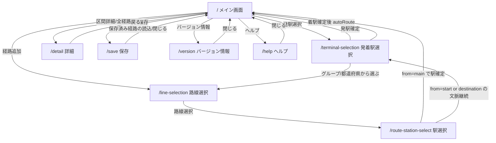

# 画面遷移と入出力

## 目的
- 画面ごとの遷移関係だけでなく、入力、共有状態、確定時の副作用を整理する。

## 画面遷移図

## 共有前提
- すべての主要画面は `initFarert()` 完了後に WASM API を利用する。
- アプリ全体の中核状態は `mainRoute` で、画面遷移の中心にもなる。

## 共有状態

| 名前 | 役割 | 主な読込画面 | 主な更新画面 |
|---|---|---|---|
| `mainRoute` | 現在編集中の経路 | `/`, `/terminal-selection`, `/route-station-select`, `/save` | `/`, `/terminal-selection`, `/route-station-select`, `/save` |
| `savedRoutes` | 保存済み routeScript 一覧 | `/save` | `/save` |
| `ticketHolder` | きっぷホルダ一覧 | `/`, `/save` | `/` |
| `stationHistory` | 駅履歴 | `/terminal-selection` | `/terminal-selection` |
| `mainScreenErrorMessage` | メイン画面へ返す一時メッセージ | `/` | `/terminal-selection` |

## 画面別 I/O

### `/` メイン画面

#### 入力
- `mainRoute`
- `ticketHolder`
- `mainScreenErrorMessage`

#### 出力
- `/terminal-selection` へ発駅選択遷移
- `/line-selection` へ経路追加遷移
- `/detail?r=...` へ詳細遷移
- `/save`, `/version`, `/help` へ遷移
- `ticketHolder` 更新
- `mainRoute` 更新

#### 主要副作用
- `removeTail()`, `removeAll()`, `reverse()`
- 経路オプション setter
- きっぷホルダ追加、共有、並べ替え

### `/terminal-selection` 発着駅選択

#### 入力
- `mode=start|destination`
- `stationHistory`
- `mainRoute`

#### 内部状態
- `tab`
- `stage`
- `searchMode`
- `selectionBase`
- 選択中の会社 / 都道府県 / 路線

#### 出力
- 発駅確定時:
  - 新しい `mainRoute` を作成
  - `stationHistory` 更新
  - `/` に戻る
- 着駅確定時:
  - `mainRoute.autoRoute()` 実行
  - `stationHistory` 更新
  - 失敗時は `mainScreenErrorMessage` 設定
  - `/` に戻る
- グループ / 都道府県経由では `/line-selection` に進む

#### 主な WASM 呼び出し
- `getCompanys()`
- `getPrefects()`
- `getLinesByCompany()`
- `getLinesByPrefect()`
- `getStationsByCompanyAndLine()`
- `getStationsByPrefectureAndLine()`
- `getStationsByLine()`
- `searchStationFuzzy()`
- `getKanaByStation()`
- `getPrefectureByStation()`
- `autoRoute()`

### `/line-selection` 路線選択

#### 入力
- `from=main|start|destination`
- `station?`
- `line?`
- `prefecture?`
- `group?`

#### 出力
- 狭幅時は、選択した路線を付与して `/route-station-select` へ遷移
- 広幅時は、同一画面内の駅選択ペインへ選択路線を渡して表示更新
- `from=main` では `最短経路` 導線で `/terminal-selection?mode=destination` へ遷移

#### 主な責務
- 文脈に応じた路線一覧の取得
- 直前路線の再選択禁止
- 親文脈の保持

### `/route-station-select` 駅選択

#### 入力
- `from=main|start|destination`
- `line`
- `station?`
- `prefecture?`
- `group?`
- `mainRoute`

#### 内部状態
- `mode=branch|destination`
- `branchStations`
- `destinationStations`
- `stationDetails`

#### 出力
- `from=main`:
  - `mainRoute.addRoute(line, station)`
  - 成功時は `/` に戻る
- `from=start|destination`:
  - 選択文脈を保ったまま `/terminal-selection` フローへ戻す

#### 主な WASM 呼び出し
- `getBranchStationsByLine()`
- `getStationsByLine()`
- `getKanaByStation()`
- `getLinesByStation()`
- `executeSql()`

### `/detail` 詳細

#### 入力
- `r`: 圧縮済み経路文字列

#### 内部状態
- 復元済み route
- `fareInfo`
- オプションメニュー配列
- 共有メッセージ
- エクスポートメッセージ

#### 出力
- 共有 URL 共有またはコピー
- 結果テキストのエクスポート
- WASM オプション切替による再計算

### `/save` 保存

#### 入力
- `mainRoute`
- `savedRoutes`
- `ticketHolder`

#### 内部状態
- 編集モード
- 上書き確認状態
- インポートダイアログ状態

#### 出力
- 保存済み経路の追加 / 削除
- 保存済み経路の読込
- テキスト複数行インポート
- テキスト共有またはコピーによるエクスポート

### `/version` バージョン情報

#### 入力
- `APP_VERSION`, `BUILD_AT`, `GIT_COMMIT_AT`, `GIT_SHA`
- `databaseInfo()`

#### 出力
- 更新確認
- 更新適用
- サポートサイト遷移

### `/help` ヘルプ

#### 入力
- なし

#### 出力
- 外部導線
- `/` へ戻る

## 代表フロー

### 新規経路作成
1. メイン画面から発駅選択へ進む
2. 発着駅選択で駅を確定する
3. `mainRoute = new Farert()` と `addStartRoute()` を実行する
4. メイン画面へ戻る
5. 経路追加から路線選択、駅選択へ進む
6. `mainRoute.addRoute()` を繰り返す

### 最短経路作成
1. メイン画面または路線選択画面から `mode=destination` の発着駅選択へ進む
2. 着駅を確定する
3. 新幹線利用確認を行う
4. `mainRoute.autoRoute()` を実行する
5. 結果をメイン画面へ反映する

### 保存済み経路の再読込
1. 保存画面で routeScript を選ぶ
2. 必要なら上書き確認を行う
3. `buildRoute(routeScript)` で `mainRoute` を置き換える
4. メイン画面へ戻る
